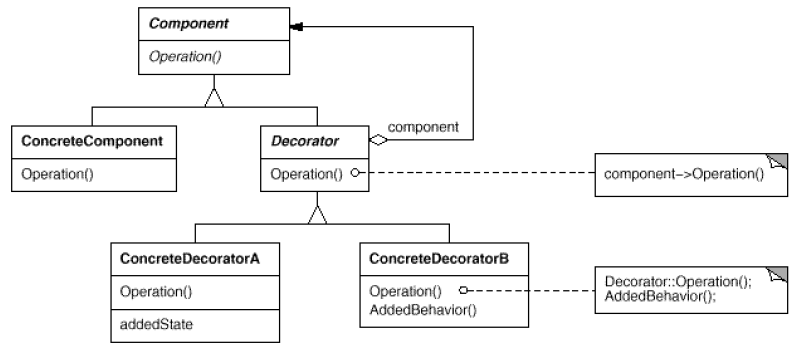

# 클래스 다이어그램
- 클래스 상호관계의 협력 관례를 나타내는 다이어그램
- 클래스 간의 설계할 때 유용

## 연관관계
- 클래스 상호 간에 서로 연관되어 있음을 나타냄
- 단방향은 화살표 (->) 로 표현
- 양방향은 직선(-) 으로 표현
- 연관된 개체 수를 표현할 때에는 선 끝에 다중성을 나타낸다

## 집합관계
- 연관관계에 특별한 경우
### 집약관계
- 빈 마름모로 표시
- 포함하는 객체가 사라져도 포함된 객체는 사라지지 않음

### 합성관계
- 채워진 마름모로 표시
- 주로 변수로 선언하여 사용
- 포함하는 객체가 사라지면 포함된 객체도 사라짐

## 의존관계
- 실선으로 표시
- 연관관계보다 짧은 생명주기
- 매개변수나 지역변수로 구현

## 일반화관계
- 상속 관계
- 일반적인 클래스(상위 클래스)를 보다 구체적인 클래스(하위 클래스)가 상속함

## 실체화 관계
- 인터페이스를 구현하는 클래스는 선언된 기능을 구현할 책임이 있음
- 여러 클래스가 인터페이스를 구현하므로써 다형성 제공

## 접근제어자
<table>
<th>접근제어자</th>
<th>표시</th>
<th>설명</th>
<tr>
<td>public</td>
<td>+</td>
<td>내부, 외부 모드 접근 가능</td>
</tr>
<tr>
<td>protected</td>
<td>*</td>
<td>같은 패키지나 상속관계의 클래스만 접근 가능</td>
</tr>
<tr>
<td>default</td>
<td>~</td>
<td>같은 패키지만 접근 가능</td>
</tr>
<tr>
<td>private</td>
<td>-</td>
<td>같은 클래스 내부에서만 접근 가능</td>
</tr>

</table>