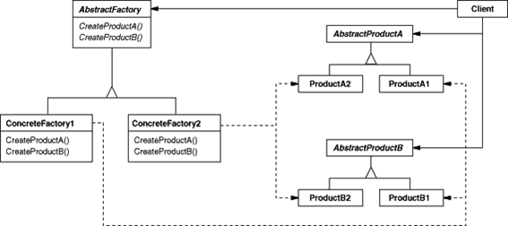

# Abstrcat Factory Pattern
- 여러 제품을 한꺼번에 생성하는 패턴

# 의도와 동기
- 구체적인 클래스를 생성하지 않고도 서로 관련성이 있거나 독립적인 여러 객체의 군을 생성하기 위한 인터페이스
- 추상화된 인터페이스 팩토리를 제공하고 상황에 따라 그에 맞는 인스턴스들이 생성되도록 함
- 생성되고 구성되고 표현되는 방식과 무관하게 시스템을 독립적으로 만들고자 할 때
- 하나 이상의 제품군들 중 하나를 선택하여 시스템을 설정하고 한번 구성한 제품을 다른 것으로 대체 할 수 있을 때

# 다이어그램

# 객체협력
- AbstractFactory :
개념적 제품에 대한 객체를 생성하는 오퍼레이션 인터페이스를 정의한다

- ConcreteFactory :
구체적인 제품에 대한 객체를 생성하는 오퍼레이션을 구현한다.

- AbstractProduct :
개념적 제품 객체에 대한 인터페이스를 정의한다.

- ConcreteProduct :
구체적으로 팩토리가 생성할 객체를 정의하고, AbstractProduct 가 정의하고 있는 인터페이스를 구현한다.

- Client :
AbstractFactory 와 AbstractProduct 클래스에 선언된 인터페이스를 사용한다.

