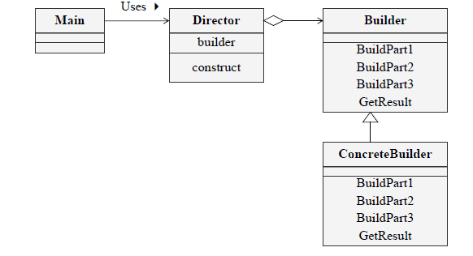

# Builder Pattern
- 생성에 대한 과정과 각 결과물을 표현하는 방법을 분리하여 동일한 생성 과정에서 여러 결과물이 나올 수 있음
- 클라이언트 코드는 Builder가 제공하는 메서드를 기반으로 결과물 도출 가능
- 새로운 결과물이 필요한 경우에도 동일한 과정으로 생성 가능

## Class diagram (GoF)

## 객체 협력 (collaborations)

- **Builder**
  Product의 각 요소들을 생성하는데 필요한 추상 메서드가 선언된 클래스나 인터페이스

- **ConcreteBuilder**
  Builder에 선언된 메서드를 구현한 클래스

- **Director**
  Builder 인터페이스를 사용하여 Product를 생성

- **Product**
  결과물 
