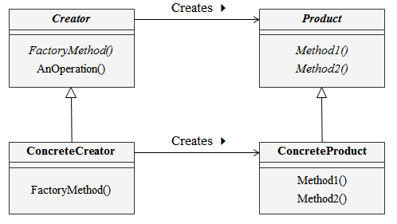

# Factory Method
- 인터페이스 작성을 하위 클래스에게 위임
- Template Method 패턴을 인스턴스 생성에 적용

## 의도와 동기
- 객체를 생성하기 위한 인터페이스를 정의하지만, 어떤 클래스의 인스턴스를 생성할지 결정은 서브 클래스에서 결정
- 여러 상황에 따라 각각 생성될 수 있는 객체에 대한 생성을 하위 클래스에 위임
- 생성과 관련된 동일한 메서드는 상위 클래스에서 처리

## Class diagram

