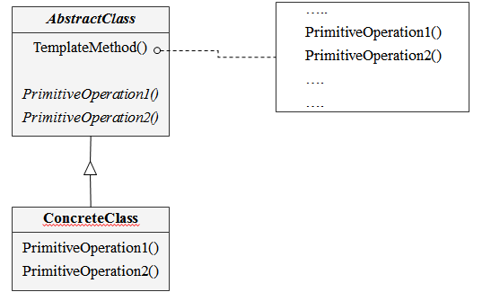

# Template Method
- 상위 클래스에서 전체적인 흐름을 구현하고 구체적인 처리는 하위 클래스에 위임

## 의도와 동기
- Operation에 알고리즘 기본 골격 구조를 정의하고 구체적인 단계는 서브클래스에 정의한다
- 추상화된 함수를 통해 알고리즘 이룹 단계를 정의함으로써 템플릿 메소드의 처리순서를 정할 수 있다.

## Class diagram

## 객체 협력
- **AbstractClass**

 서브 클래스들이 반드시 구현해야 하는 알고리즘 처리 단계 내의 기본 오퍼레이션이 무엇인지를 정의한다. 서브 클래스에서 이들 오퍼레이션들을 구현한다.

- **ConcreteClass**

 상위 클래스에서 선언된 추상 메서드를 구현하거나 이미 구현된 메서드를 재정의한다
