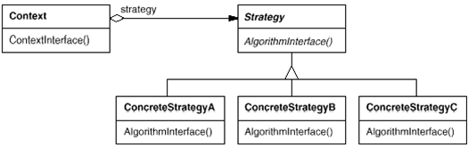

# Strategy Pattern
- 정책이나 알고리즘을 교체하여 사용 가능

# 의도와 동기
- 다양한 알고리즘이 존재하면 이들 각각을 하나의 클래스로 캡슐화하여 알고리즘의 대체가 가능하도록 한다.

- 클라이언트와 독립적인 다양한 알고리즘을 적용할 수 있도록 한다.

- 사용자가 모르고 있는 데이터를 사용하여 여러 정책들이 반영될 수 있도록 구현

- 여러 정책이 수행되어야 하는 조건들 (if-else, switch) 문이 없어질 수 있다

# Class diagram

# 객체 협력
- Strategy 

  - 정책이 수행해야 하는 기능들을 인터페이스로 선언

- ConcreteStrategy 

  - Strategy에 선언된 여러 기능들을 구현

  - 다양한 정책들이 구현될 수 있음

- Context

  - 어떤 ConcreteStrategy 가 수행 될 것인지에 따라 정책을 선택한다

  - Strategy에 선언된 메서드 기반으로 접근한다.

  - Strategy 클래스와 Context 클래스는 선택한 알고리즘이 동작하도록 협력한다.

